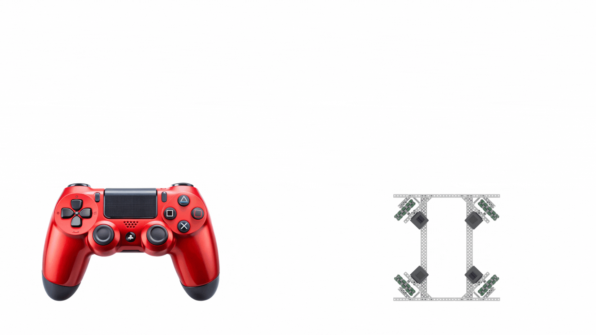

# Josjisbot

## Penjelasan singkat
Josjisbot adalah robot holonomic dengan konfigurasi x-drive dan roda omni. Saat ini josjisbot baru berbentuk virtual dan baru bisa dikendalikan menggunakan `teleop_twist_keyboard`, meski demikian josjisbot memiliki dua tipe controller: robot-centric dan world-centric. Sekarang ini kedua controller memang belum bisa menggerakan robot secara fisik, namun sudah controller sudah menghitung kecepatan yang dibutuhkan oleh setiap roda di topic `/josjisbot_controllers/commands`. Yang nantinya daapat di-susbscribe oleh microcontroller menggunakan microros.


### Robot-centric vs world-centric?
Dalam kasus ini robot-centric berarti perintah dari pilot dijalankan oleh robot apa adanya, **tanpa mempertimbangkan arah hadapannya sendiri**. Hal ini dapat membuat pilot yang belum terbiasa kesulitan untuk mengendalikan robot.


Ilustrasi pergerakan robot-centric

Sedangkan world-centric berarti perintah dari pilot dijalankan oleh robot **dengan mempertimbangkan arah hadapannya sendiri**. Hal ini akan memudahkan pilot yang belum terbiasa mengendalikan robot.


Ilustrasi pergerakan world-centric

## Cara menjalankan program
Program ditulis agar dapat berjalan di ROS2 Jazzy Jalisco, jika anda belum menginstallnya, mohon kunjungi laman berikut: [Installation — ROS 2 Documentation: Jazzy documentation](https://docs.ros.org/en/jazzy/Installation.html)
```bash
git clone https://github.com/daffarandika/josjisbot
cd josjisbot
rosdep update
rosdep install --from-paths src --ignore-src -r -y
colcon build
source install/setup.sh
ros2 launch josjisbot_bringup display.launch.py is_robot_centric:=false
```

dan pada terminal baru
```bash
ros2 run teleop_twist_keyboard teleop_twist_keyboard --ros-args -p stamped:=true
```

## Penjelasan Program
Program ini sudah dibuat menggunakan OOP dan menerapkan konsep dari 4 pilar OOP
1. Inheritance

Program dalam project ini telah menerapkan inheritance menggunakan class dari rclcpp::Node dan class buatan sendiri bernama RobotController:
```cpp
class RobotController {
protected:
	virtual Float32MultiArray inverseKinematics(const TwistStamped& cmd) = 0;
	virtual TwistStamped forwardKinematics(const Float32MultiArray& wheel_cmd) = 0;
	float simulateNoise() { ... }
	double normalizeAngle(double angle) { ... }
};
```
class ini kemudian di-inherit oleh class WorldCentricController dan RobotCentricController, class ini secara tidak langsung juga mengabstraksi logika-logika yang sering digunakan ke dalam sebuah method

2. Abstraksi
   
Program dalam project ini berulang kali menggunakan abstraksi untuk memudahkan programmer kedepannya, salah contoh penerapannya antara lain:
```cpp
void RobotCentricController::cmdCallback(const TwistStamped& msg)
{
	this->wheel_cmd_ = this->inverseKinematics(msg);

	this->x_ += msg.twist.linear.x + simulateNoise();
	this->y_ += msg.twist.linear.y + simulateNoise();
	this->heading_ += msg.twist.angular.z + simulateNoise();
	this->heading_ += msg.twist.angular.z + simulateNoise();
	this->heading_ = this->normalizeAngle(this->heading_);
  ...
}
```
Di mana inverseKinematics, simulateNoise, dan normalizeAngle merupakan method yang telah dibuat sebelumnya di class RobotController

3. Polymorfisme

Program di project ini telah menerapkan polimorfisme ketika class WorldCentricController dan RobotCentricController meng-inherit RobotController.

RobotController

```cpp
class RobotController {
protected:
	virtual Float32MultiArray inverseKinematics(const TwistStamped& cmd) = 0;
	virtual TwistStamped forwardKinematics(const Float32MultiArray& wheel_cmd) = 0;
	...
};
```

WorldCentricController

```cpp
Float32MultiArray WorldCentricController::inverseKinematics(const TwistStamped& cmd)
{
...
}
```

RobotCentricController

```cpp
Float32MultiArray RobotCentricController::inverseKinematics(const TwistStamped& cmd)
{
...
}
```

4. Enkapsulasi

Enkapsulasi sudah dilakukan berulangkali dalam program ini, berikut salah satu contohnya:
```cpp
class RobotCentricController:
	public rclcpp::Node,
	public RobotController
{
public:
	RobotCentricController(const std::string& name);

private:
	rclcpp::Publisher<Float32MultiArray>::SharedPtr wheel_cmd_pub_;
	rclcpp::Subscription<TwistStamped>::SharedPtr cmd_sub_;

	const std::array<float, 4> wheel_angles_ = {45.0, 135.0, 225.0, 315.0}; // alpha 1-4
	Float32MultiArray wheel_cmd_;
	float x_, y_, heading_;

	void cmdCallback(const TwistStamped& msg);
	Float32MultiArray inverseKinematics(const TwistStamped& cmd) override;
	TwistStamped forwardKinematics(const Float32MultiArray& wheel_cmd) override;
};
```
Program telah dipisah berdasarkan visibiltas yang diinginkan dari luar class.
